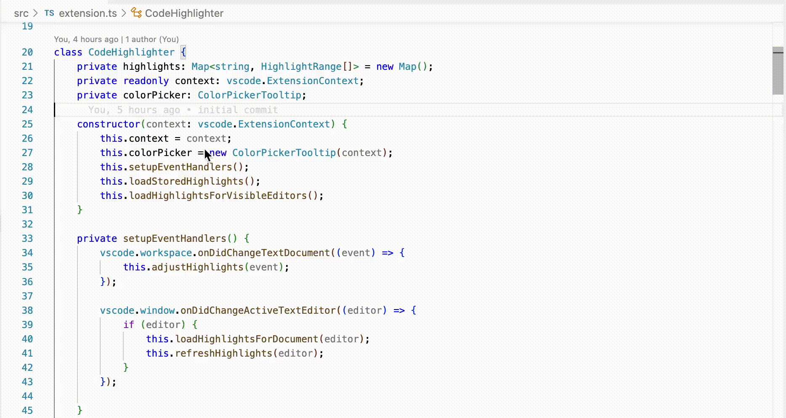

# Code Highlighter



A VSCode extension that allows you to highlight code with different colors using keyboard shortcuts. Perfect for marking important code sections, todos, or organizing your thoughts while reading code.

## Features

- **Fast keyboard-driven highlighting**: Use `Cmd+[1-9]` to instantly highlight selected text
- **Smart partial clearing**: Remove only selected portions of highlights while keeping the rest intact
- **Persistent highlights**: Your highlights are saved and restored when files are reopened
- **Configurable colors**: Customize the highlight colors in your VSCode settings
- **Dynamic adjustment**: Highlights automatically adjust when you edit the code

## Usage

### Highlighting Text
1. Select the text you want to highlight
2. Press `Cmd+[1-9]` to apply a color:
   - `Cmd+1` - Green highlight
   - `Cmd+2` - Red highlight  
   - `Cmd+3` - Yellow highlight
   - `Cmd+4` - Blue highlight
   - `Cmd+5` - Purple highlight
   - `Cmd+6` - Orange highlight
   - `Cmd+7-9` - Additional colors (if configured)

### Clearing Highlights
- `Cmd+0` - Clear highlight from selected text (smart partial removal)
- Command Palette: "Clear All Highlights" - Remove all highlights from current file

### Smart Partial Clearing
When you select part of a highlighted text and press `Cmd+0`:
- Only the selected portion gets unhighlighted
- If you select the middle, it splits the highlight into two parts
- If you select the beginning/end, it trims that portion

**Example:**
- Highlight: `function myFunction()`
- Select: `Function` (middle part)
- Press `Cmd+0`
- Result: `function my` and `()` remain highlighted, `Function` is cleared

## Extension Settings

This extension contributes the following settings:

* `codeHighlighter.colors`: Array of colors to use for highlighting (with alpha channel)

**Default colors:**
```json
{
  "codeHighlighter.colors": [
    "#4caf5040",  // Green
    "#ff572240",  // Red
    "#ffeb3b40",  // Yellow
    "#2196f340",  // Blue
    "#9c27b040",  // Purple
    "#ff980040"   // Orange
  ]
}
```

### Customizing Colors
Add this to your VSCode settings.json to customize colors:
```json
{
  "codeHighlighter.colors": [
    "#your-color-1",
    "#your-color-2",
    // ... up to 9 colors
  ]
}
```

Colors should be in hex format with alpha channel (e.g., `#ff000040` for semi-transparent red).

## Keyboard Shortcuts

| Shortcut | Action |
|----------|--------|
| `Cmd+1` | Highlight with color 1 |
| `Cmd+2` | Highlight with color 2 |
| `Cmd+3` | Highlight with color 3 |
| `Cmd+4` | Highlight with color 4 |
| `Cmd+5` | Highlight with color 5 |
| `Cmd+6` | Highlight with color 6 |
| `Cmd+7` | Highlight with color 7 |
| `Cmd+8` | Highlight with color 8 |
| `Cmd+9` | Highlight with color 9 |
| `Cmd+0` | Clear highlight at selection |

## Customizing Keyboard Shortcuts

You can customize the keyboard shortcuts to your preference using VSCode's built-in keybinding editor.

### Method 1: Using the GUI (Recommended)
1. Open VSCode Settings (`Cmd+,` on macOS, `Ctrl+,` on Windows/Linux)
2. Click on "Keyboard Shortcuts" or press `Cmd+K Cmd+S` (on macOS) / `Ctrl+K Ctrl+S` (on Windows/Linux)
3. Search for "Code Highlighter" or "codeHighlighter"
4. Click the pencil icon next to any command to reassign its shortcut
5. Press your desired key combination and hit Enter

### Method 2: Using keybindings.json
1. Open the Command Palette (`Cmd+Shift+P` / `Ctrl+Shift+P`)
2. Type "Preferences: Open Keyboard Shortcuts (JSON)" and select it
3. Add your custom keybindings:

```json
{
  "key": "your-preferred-key",
  "command": "codeHighlighter.highlight1",
  "when": "editorTextFocus"
}
```

### Available Commands
- `codeHighlighter.highlight1` - Highlight with color 1
- `codeHighlighter.highlight2` - Highlight with color 2
- `codeHighlighter.highlight3` - Highlight with color 3
- `codeHighlighter.highlight4` - Highlight with color 4
- `codeHighlighter.highlight5` - Highlight with color 5
- `codeHighlighter.highlight6` - Highlight with color 6
- `codeHighlighter.highlight7` - Highlight with color 7
- `codeHighlighter.highlight8` - Highlight with color 8
- `codeHighlighter.highlight9` - Highlight with color 9
- `codeHighlighter.clearHighlightAtSelection` - Clear highlight at selection
- `codeHighlighter.clearHighlights` - Clear all highlights in file

### Example Custom Keybindings
```json
[
  {
    "key": "ctrl+shift+1",
    "command": "codeHighlighter.highlight1",
    "when": "editorTextFocus"
  },
  {
    "key": "ctrl+shift+0",
    "command": "codeHighlighter.clearHighlightAtSelection", 
    "when": "editorTextFocus"
  }
]
```